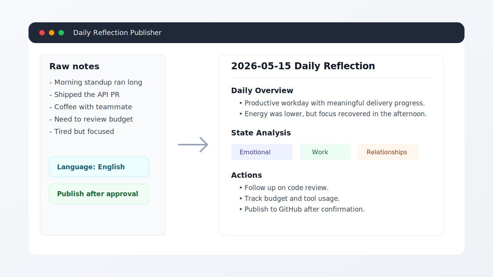

# Daily Reflection Publisher

Turn messy daily notes into a structured personal-growth Markdown reflection, confirm the result, then publish it to your own GitHub repo.



## Quick Start

Copy this skill into Codex:

```bash
mkdir -p ~/.codex/skills
cp -R daily-reflection-publisher ~/.codex/skills/
```

Use it:

```text
Use $daily-reflection-publisher to generate today's daily reflection.

[paste your raw daily notes]
```

Chinese works too:

```text
用 $daily-reflection-publisher 生成一下今天流水账：

[粘贴今天的原始记录]
```

## Configure Two Things

### 1. Output language

Tell the skill what language you want:

- `Preserve mixed language`: keep Chinese as Chinese, English as English, and mixed notes mixed.
- `Chinese`: output Chinese headings and summaries.
- `English`: output English headings and summaries.
- `Custom`: use your requested bilingual style.

Example:

```text
用 $daily-reflection-publisher 生成一下今天流水账，输出中文：

[粘贴原始记录]
```

If you do not specify a language, the skill should ask you to choose before generating the reflection.

### 2. GitHub repo

Create your own GitHub repo for daily entries, then provide its URL when publishing.

```bash
export DAILY_REFLECTION_REPO_URL="https://github.com/YOUR_USERNAME/YOUR_DAILY_REPO.git"
```

The default output path is:

```text
daily/YYYY-MM-DD.md
```

## What the Skill Produces

- Raw record
- Daily overview
- Facts
- Thoughts
- Emotional, work, and relationship state analysis
- Exposed problems
- Long-term preferences and patterns
- Highlights
- Actions
- Archive-ready summary

The skill asks for confirmation before publishing. It will not overwrite an existing daily entry unless you explicitly approve overwrite behavior.

## Manual Publish Command

Most users do not need this, but the underlying script is:

```bash
scripts/publish_daily_reflection.py \
  --date YYYY-MM-DD \
  --input /path/to/confirmed-entry.md \
  --repo-url https://github.com/YOUR_USERNAME/YOUR_DAILY_REPO.git
```

## Privacy

Daily reflections can contain sensitive personal information. Use a private GitHub repo unless you intentionally want the entries to be public.
